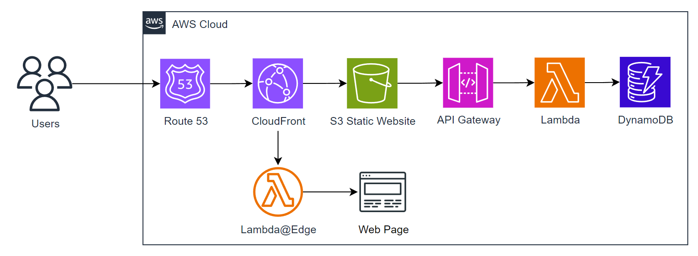

# Serverless URL shortener

Serverless URL shortener using Route 53, CloudFront, S3, API Gateway, Lambda and DynamoDB with Terraform.

### Index
* <a href="#solution-architecture">Solution Architecture</a>
  * <a href="#solution-flow">Solution Flow</a>
* <a href="#terraform">Terraform</a>
  * <a href="#configuration-files">Configuration Files</a>
  * <a href="#terraform-docs">terraform-docs</a>
  * <a href="#terraform-blocks-documentation">Terraform Blocks Documentation</a>
* <a href="#provision-and-deployment">Provision and Deployment</a>
  * <a href="#prerequisite">Prerequisite</a>
  * <a href="#run">Run</a>
  * <a href="#destroy">Destroy</a>
* <a href="#demo">Demo</a>
  * <a href="#add-url-pair">Add URL pair</a>
  * <a href="#access-url">Access URL</a>
  * <a href="#delete-url-pair">Delete URL pair</a>

---

## Solution Architecture

### Solution Flow

---

##  Terraform

### terraform-docs

``terraform-docs`` is a utility to generate documentation from Terraform modules in various output formats.

It can be triggered by GitHub Actions thanks to the following workflow: **[.github/workflows/terraform-docs.yaml](.github/workflows/terraform-docs.yaml)**

The documentation it generates is located at **[docs/terraform-docs.md](docs/terraform-docs.md)**

More info can be found at https://terraform-docs.io/

### Configuration Files
| Configuration file | Description                                                                                                                                                                                                                                                                                                                                                                                                                               |
|--------------------|-------------------------------------------------------------------------------------------------------------------------------------------------------------------------------------------------------------------------------------------------------------------------------------------------------------------------------------------------------------------------------------------------------------------------------------------|
| ``versions.tf``    | Specifies AWS provider version and region. Default profile will be used.                                                                                                                                                                                                                                                                                                                                                                  |
| ``cloudfront.tf``  | Creates a CloudFront distribution with both origin and behaviour for the **API Gateway** and the **S3 static website**.                                                                                                                                                                                                                                                                                                                   |
| ``dynamodb.tf``    | Creates the DynamoDB Key-Value database table. * Table is named: **urls_db** * Primary key is named: **keyword** * Value attribute will be named: **full_url** * On-Demand capacity mode is enabled with **PAY_PER_REQUEST** billing mode.                                                                                                                                                                                |
| ``variables.tf``   | Defines the following Lambda functions metadata (name, description and endpoint): * **add-url-pair** - Adds a new URL pair into the database. It will warn you if the **keyword** is already in use. * **delete-url-pair** - Removes a URL pair from the database. It will warn you if the **keyword** is not in use. * **redirect** -                                                                                        |
| ``iam.tf``         | Performs the following actions: 1. Creates the IAM role for Lambda. 2. Attaches an *AWSLambdaBasicExecutionRole* policy to it. 3. Creates a policy to allow all DynamoDB actions on the created table performed by the Lambda role.                                                                                                                                                                                           |
| ``lambda.tf``      | Creates the Lambda functions defined on ``variables.tf`` using the Python functions located at ``/lambdas`` and assigns them the role created on ``iam.tf``.                                                                                                                                                                                                                                                                              |
| ``api_gateway.tf`` | Performs the following actions: 1. Creates the **HTTP** type API Gateway 2. Attaches the stage called **url-shortener** to it. 3. Setup API logging into CloudWatch. 4. Integrates the Lambda functions URI to the API Gateway with an **AWS_PROXY** type. 5. Creates the Lambdas routes (endpoints) using above integrations. 6. Establish **AllowExecutionFromAPIGateway** permission for the Lambda functions. |
| ``s3.tf``          | Perform the following actions for hosting a static website that servers as a landing page: 1. Creates a bucket called **serverless-url-shortener**. 2. Specifies the bucket web files (*index.html* & *error.html*). 3. Enables versioning in the bucket. 4. Establishes a bucket public access ACL settings. 5. Attaches a public access bucket policy.                                                              |

### Terraform Blocks Documentation
Terraform blocks documentation can be found at **[docs/terraform_blocks_documentation.md](docs/terraform_blocks_documentation.md)**

---

## Provisioning and Deployment

### Prerequisite

### Run

### Destroy

---

## Demo

### Add URL pair

### Access URL

### Delete URL pair