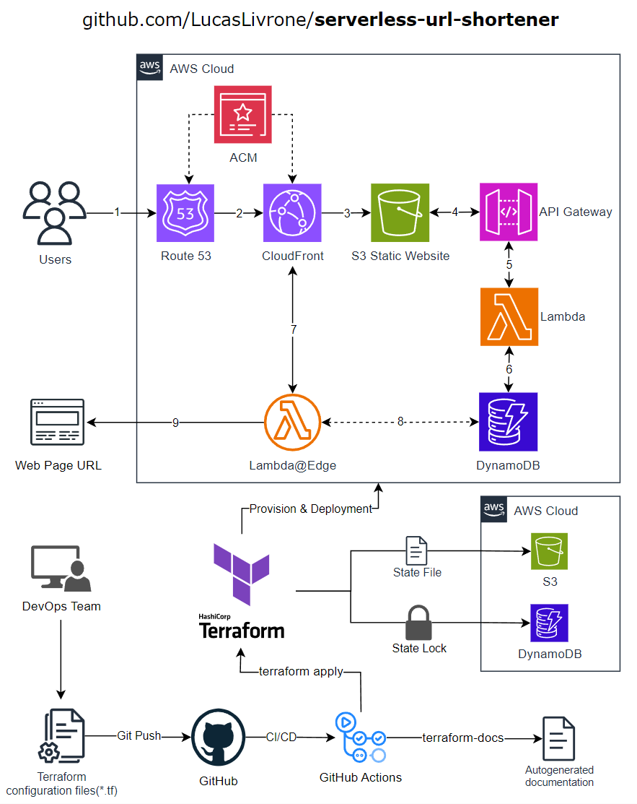

# Serverless URL shortener

Serverless URL shortener using Route 53, CloudFront, S3, API Gateway, Lambda and DynamoDB with Terraform.

### Index
* <a href="#solution-architecture">Solution Architecture</a>
  * <a href="#solution-flow">Solution Flow</a>
* <a href="#terraform">Terraform</a>
  * <a href="#terraform-docs">terraform-docs</a>
* <a href="#provisioning-and-deployment">Provisioning and Deployment</a>
  * <a href="#prerequisites">Prerequisites</a>
  * <a href="#run">Run</a>
  * <a href="#destroy">Destroy</a>
* <a href="#demo">Demo</a>
  * <a href="#add-url-pair">Add URL pair</a>
  * <a href="#access-url">Access URL</a>
  * <a href="#delete-url-pair">Delete URL pair</a>

---

## Solution Architecture



### Solution Flow

1. The users access the URL shortener by using a custom domain thanks to Route 53 DNS routing service.
2. AWS Certificate Manager (ACM) handles the SSL/TLS certificate and Route 53 directs the users to the CloudFront distribution. 
3. The CloudFront distribution serves an S3 static website, providing a user-friendly interface for the URL shortener.
4. When users add or delete URL pairs, the S3 static website communicates with an API Gateway endpoint to send the request and display the feedback.
5. The API Gateway triggers the corresponding Lambda function that performs the requested action and provide feedback.
6. The Lambda functions will create or delete records in DynamoDB and respond with success or failure feedback.
7. When users use the URL shortener to redirect, a Lambda@Edge function is executed.
8. The Lambda@Edge triggers a function that retrieves the full URL from DynamoDB based on the provided keyword.
9. The user's browser is redirected to the desired web page URL, completing the redirection process. It will also be redirected to an Error site in case the web page URL is not found on the DB.

---

##  Terraform

| Configuration file | Description                                                                                                                                                                                                                                                                                                                                                                                                                   |
|--------------------|-------------------------------------------------------------------------------------------------------------------------------------------------------------------------------------------------------------------------------------------------------------------------------------------------------------------------------------------------------------------------------------------------------------------------------|
| ``acm.tf``         | Creates an AWS ACM (Amazon Certificate Manager) certificate for a custom domain and subdomain, with DNS validation. It also tracks the validation status of the certificate to ensure successful validation before proceeding with other resource creation or updates that depend on the validated certificate.                                                                                                               |
| ``api_gateway.tf`` | Defines and provisions an AWS API Gateway named "url-shortener-api" with an HTTP protocol, including a deployment stage for it, and configures access logging to a CloudWatch Logs group. It also sets up AWS_PROXY integrations between the API Gateway and AWS Lambda functions, defines the API Gateway routes for the Lambda functions, and grants permissions for the Lambda functions to be invoked by the API Gateway. |
| ``backend.tf``     | Specifies the use of an S3 backend to store the Terraform state file and state lock information. It defines the S3 bucket, key (file path within the bucket), AWS region, encryption settings, and a DynamoDB table for state locking to provide safe and concurrent access to the Terraform state.                                                                                                                           |
| ``cloudfront.tf``  | Defines an AWS CloudFront distribution that serves as a content delivery network for both an API Gateway and an S3 static website, specifying various settings and behaviors for routing and caching. It also also associates a Lambda@Edge function that will help with the URL redirect.                                                                                                                                    |
| ``dynamodb.tf``    | Creates an AWS DynamoDB table named "urls-db" with a billing mode of "PAY_PER_REQUEST" (on-demand capacity mode), and it defines a primary key attribute "keyword".                                                                                                                                                                                                                                                           |
| ``iam.tf``         | Defines an IAM role named "iam-for-lambda" for AWS Lambda and Lambda@Edge, attaches the AWS Lambda basic execution policy to it, and creates an IAM policy allowing access to a DynamoDB table for Lambda functions.                                                                                                                                                                                                          |
| ``lambda.tf``      | Creates AWS Lambda functions and Lambda@Edge function, using ZIP archives as their source code, with specified roles and configurations.                                                                                                                                                                                                                                                                                      |
| ``outputs.tf``     | Defines an output named "serverless-url-shortener" that provides the URL of the "serverless-url-shortener" application, which is constructed using the fully qualified domain name (FQDN) of an AWS Route 53 record for a subdomain associated with the application.                                                                                                                                                          |
| ``providers.tf``   | Specifies the required Terraform provider and its version. It defines the configuration for the AWS provider, specifying the AWS region.                                                                                                                                                                                                                                                                                      |
| ``route53.tf``     | Sets up Route 53 DNS (Domain Name System) configurations for the specified domain and subdomain by configuring the necessary DNS records for routing traffic to the appropriate AWS resources and for validating the ACM certificate, allowing for secure and reliable domain management.                                                                                                                                     |
| ``s3.tf``          | Creates and configures an AWS S3 bucket to host a static website, enables versioning, sets ownership controls and public access settings, and uploads the index.html and error.html files.                                                                                                                                                                                                                                    |
| ``variables.tf``   | Defines various input variables for the Terraform configuration, including the AWS region, domain name, subdomain, details of Lambda functions and their expected API Gateway routes, S3 bucket name for HTML files, S3 bucket name and key for Terraform state files, and the DynamoDB table used for state locking.                                                                                                         |
| ``versions.tf``    | Specifies the required Terraform version for the project.                                                                                                                                                                                                                                                                                                                                                                     |


### terraform-docs

``terraform-docs`` is a utility for automatically generating documentation from your Terraform modules in various output formats.

It can be triggered by an automated workflow using GitHub Actions to ensure that your documentation is always up to date. You can find the workflow configuration in **[.github/workflows/documentation.yml](.github/workflows/documentation.yml)**.

The generated documentation is available in the **[docs/terraform-docs.md](docs/terraform-docs.md)** file.

For more detailed information on terraform-docs and its capabilities, please visit the official website at [terraform-docs.io](https://terraform-docs.io/).

---

## Provisioning and Deployment

### Prerequisites

**1. Install Terraform**

* Visit the official Terraform website to download the latest version for your operating system: https://developer.hashicorp.com/terraform/downloads
* Verify the installation by running ``terraform --version`` in your terminal or command prompt. You should see the installed version displayed.

**2. Create an AWS account and ACCESS KEYS**

* Visit https://aws.amazon.com/
* Click on the "Create an AWS Account" button and follow the registration process. You will need to provide your personal information and payment details.
* After your AWS account is set up, sign in to the AWS Management Console.
* In the AWS Management Console, navigate to the "IAM (Identity and Access Management)" service.
* Create an IAM user for programmatic access by following these steps:
  * Click on "Users" in the left sidebar.
  * Click on the "Add user" button.
  * Enter a username and select "Programmatic access" as the access type.
  * Set permissions for the user according to your requirements. For basic Terraform usage, you might want to attach the "AdministratorAccess" policy to the user for simplicity. However, it's recommended to follow the principle of least privilege and grant only the necessary permissions for your specific use case.
  * Review and create the user, and note down the ACCESS_KEY_ID and SECRET_ACCESS_KEY when they are displayed. These keys are required for AWS CLI and Terraform operations.

If you are using Linux OS, make sure these ACCESS KEYS are located in the following file:

````bash
$ cat ~/.aws/credentials
[default]
aws_access_key_id = <ACCESS_KEY_ID>
aws_secret_access_key = <SECRET_ACCESS_KEY>
````


**3. Add GitHub Actions secrets and variables for the Terraform**

This solution contemplates the use of input variables that Terraform will use for the configuration.

As the deployment process is automated by GitHub Actions, it's required that you create the following GitHub repository **secrets** and **variables**:

| Secrets                        | Description                                                                                 |
|--------------------------------|---------------------------------------------------------------------------------------------|
| AWS_ACCESS_KEY_ID              | ACCESS_KEY_ID created on step 2.                                                            |
| AWS_SECRET_ACCESS_KEY          | SECRET_ACCESS_KEY created on step 2.                                                        |

| Variables                      | Description                                                                                 |
|--------------------------------|---------------------------------------------------------------------------------------------|
| TF_VAR_domain_name             | Domain name for the Hosted Zone created by Route 53.                                        |
| TF_VAR_subdomain               | Subdomain of the Hosted Zone that will point to the CloudFront domain.                      |
| TF_VAR_bucket                  | The name of the S3 bucket where the HTML files will be stored. Should be unique across AWS. |
| TF_VAR_tf_state_backend_bucket | The name of the S3 bucket where the Terraform state files will be stored.                   |
| TF_VAR_tf_state_backend_key    | The key (object key) in the S3 bucket where the Terraform state file is stored.             |
| TF_VAR_tf_state_lock           | DynamoDB table to use for state locking.                                                    |

**4. Get access to manage the domain registrar DNS nameservers**

This solution is using AWS Certificate Manager alongside Route 53 in order to be exposed using a custom domain.

However, before the Amazon certificate authority (CA) can issue a certificate for your site, AWS Certificate Manager (ACM) must prove that you own or control all of the domain names that you specify in your request.

This solution contemplates that AWS Route 53 will handle all DNS requests for your domain, and you manage your DNS records within Route 53.

In the scenario that you own a domain from any registrar other than Route 53 (e.g. GoDaddy, Hostinger, etc.), a prerequisite is that you have access to update the DNS Nameserver for the domain.

**Example:**


Once Terraform has created the Route 53 hosted zoned, it would be necessary to manually update above DNS Nameservers in the domain registrar.

**5. Provision the S3 backend resources**

After the previous steps are done, and before we can continue with the provisioning of the solution, it's required to set up the resources required for the S3 backend to store the Terraform state file and state lock information. 

These are an S3 bucket, key (file path within the bucket), AWS region, encryption settings, and a DynamoDB table for state locking to provide safe and concurrent access to the Terraform state.

````bash
/serverless-url-shortener $ cd s3-remote-backend/terraform
/serverless-url-shortener/s3-remote-backend/terraform $ cat <<EOF > terraform.tfvars
tf_state_backend_bucket = "<same value as used for TF_VAR_tf_state_backend_bucket in step 3>"
tf_state_lock = "<same value as used for TF_VAR_tf_state_lock in step 3>"
EOF
/serverless-url-shortener/s3-remote-backend/terraform $ terraform init
/serverless-url-shortener/s3-remote-backend/terraform $ terraform apply -auto-approve
````

With these resources provisioned, we are good to continue.

### Run

**1. Trigger the GitHub Actions workflows**


**2. Manually update DNS Nameservers in the domain registrar:**

Once the GitHub Action workflows log shows that the Hosted Zone has been created, the next step is to access to it from the AWS Console and update the Domain Registrar Nameservers:

    aws_route53_zone.hosted_zone: Creation complete after 35s [id=Z04841651NZPBRIVGO677]


During the ``terraform apply`` execution, the ACM certificate validation will be waiting until the DNS records are updated. 

In my experience this process usually takes 30 minutes:

    aws_acm_certificate_validation.acm_certificate_validation: Still creating... [50s elapsed]
    aws_acm_certificate_validation.acm_certificate_validation: Still creating... [1m0s elapsed]
    aws_acm_certificate_validation.acm_certificate_validation: Still creating... [1m10s elapsed]
    ...
    ...
    aws_acm_certificate_validation.acm_certificate_validation: Still creating... [34m0s elapsed]
    aws_acm_certificate_validation.acm_certificate_validation: Still creating... [34m10s elapsed]
    aws_acm_certificate_validation.acm_certificate_validation: Creation complete after 34m20s [id=0001-01-01 00:00:00 +0000 UTC]

**3. Access the solution URL**


### Destroy

In order to destroy the resources created by the ``terraform-deployment.yml`` workflow you can add these steps:
````yaml
    steps:
      - name: Checkout code
        uses: actions/checkout@v3

      - name: Set up Terraform
        uses: hashicorp/setup-terraform@v2

      - name: Destroy
        run: |
          cd terraform
          terraform init
          terraform destroy -auto-approve
````


---

---

## Demo

### Add URL pair

### Access URL

### Delete URL pair